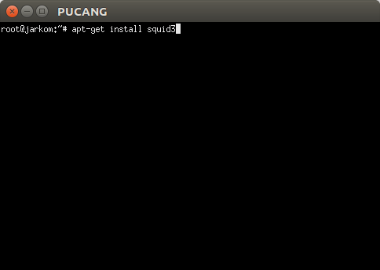
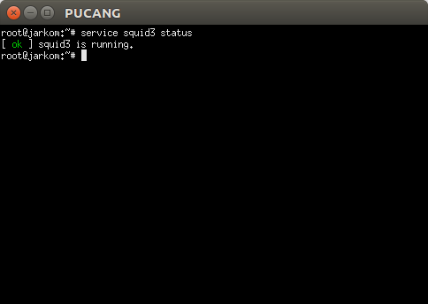
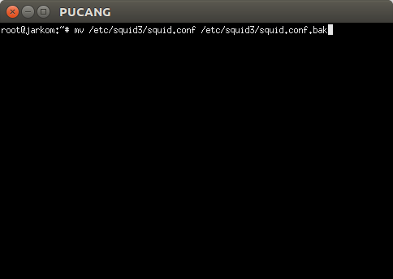
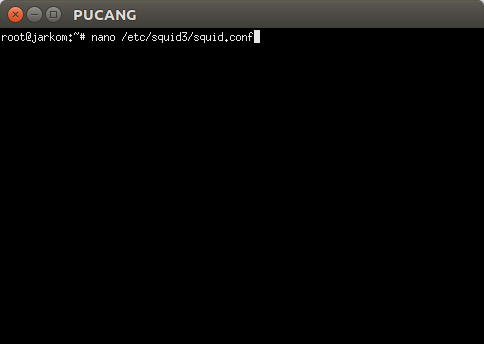
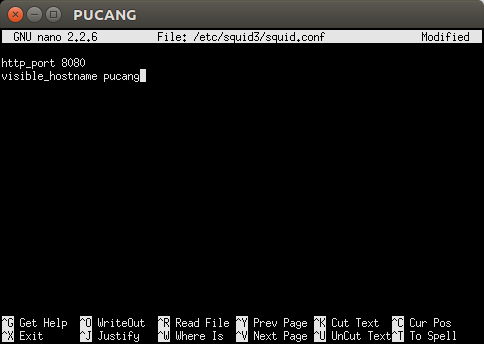
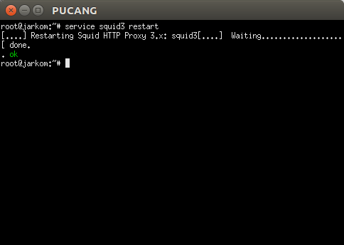
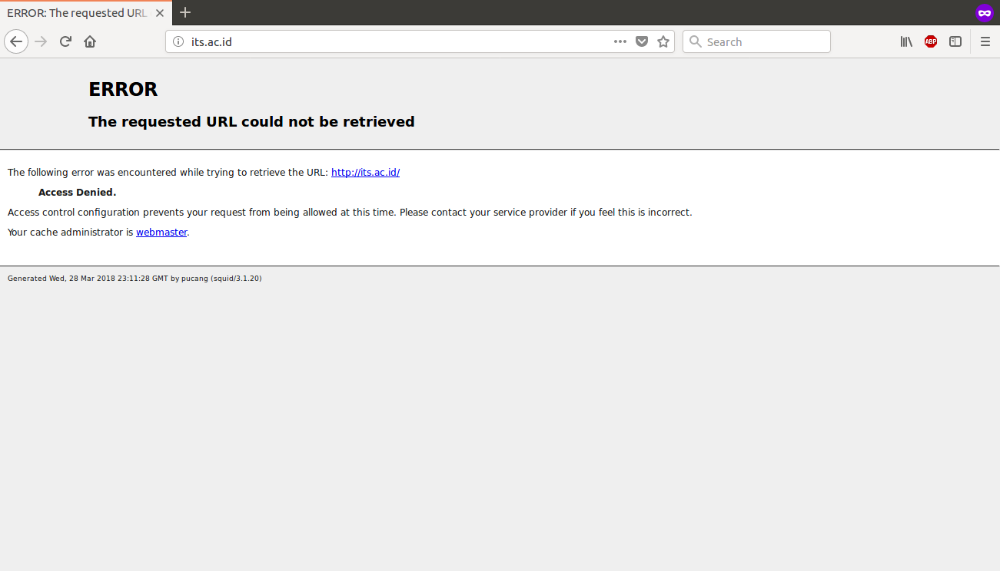
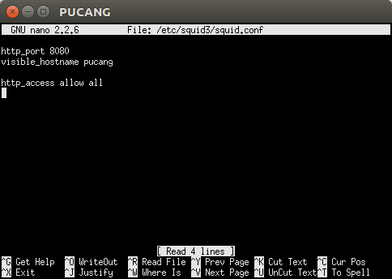

# PROXY
## **SYARAT SEBELUM MASUK KE MATERI INTI**
1. Buka **seluruh UML**.
2. Jalankan **iptables ...** di **ROUTER**.
3. Export proxy http, https, dan ftp di **seluruh UML**.
4. Jalankan **apt-get update** di **seluruh UML**.

# Proxy Server
## 1. Pengertian, Fungsi, dan Manfaat
### 1.1 Pengertian
Proxy server adalah sebuah server atau program komputer yang berperan sebagai penghubung antara suatu komputer dengan jaringan internet. Atau dalam kata lain, proxy server adalah suatu jaringan yang menjadi perantara antara jaringan lokal dan jaringan internet.

Proxy server dapat berupa suatu sistem komputer ataupun sebuah aplikasi yang bertugas menjadi gateway atau pintu masuk yang menghubungan komputer kita dengan jaringan luar.

### 1.2 Fungsi
1. ***Connection sharing*** :
Proxy bertindak sebagai gateway yang menjadi pembatas antara jaringan lokal dengan jaringan luar. Gateway bertindak juga sebagai sebuah titik dimana sejumlah koneksi dari pengguna lokal dan koneksi jaringan luar juga terhubung kepadanya. Oleh sebab itu, koneksi dari jaringan lokal ke internet akan menggunakan sambungan yang dimiliki oleh gateway secara bersama-sama (connecion sharing).
2. ***Filtering*** :
Proxy bisa difungsikan untuk bekerja pada layar aplikasi dengan demikian maka dia bisa berfungsi sebagai firewalll paket filtering yang dapat digunakan untuk melindungi jaringan lokal terhadap gangguan maupun ancaman serangan dari jaringan luar. Fungsi filtering ini juga dapat diatur atau dikonfigurasi untuk menolak akses terhadap situs web tertentu dan pada waktu- waktu tertentu juga.
3. ***Caching*** :
Sebuah proxy server mempunyai mekanisme penyimpanan obyek-obyek yang telah diminta dari server-server yang ada di internet. Dengan mekanisme caching ini maka akan menyimpan objek-objek yang merupakan berbagai permintaan/request dari para pengguna yang di peroleh dari internet.

### 1.3 Manfaat
Proxy server memiliki manfaat-manfaat berikut ini:
- Membagi koneksi
- Menyembunyikan IP
- Memblokir situs yang tidak diinginkan
- Mengakses situs yang telah diblokir
- Mengatur bandwith

## 2. Implementasi
Untuk praktikum jarkom kali ini, software proxy server yang digunakan adalah **SQUID**. UML yang digunakan sebagai proxy server adalah **PUCANG**.

### 2.1 Instalasi Squid
**STEP 1** - Pada UML **PUCANG**, ketikkan:

    apt-get install squid3

**STEP 2** - Cek status squid3 dengan mengetikkan 

    service squid3 status

Jika muncul status **ok** maka instalasi telah berhasil.

### 2.2 Konfigurasi Dasar Squid
**STEP 1** - Backup terlebih dahulu file konfigurasi default yang disediakan squid. Ketikkan perintah berikut untuk melakukan backup: 

    mv /etc/squid3/squid.conf /etc/squid3/squid.conf.bak

Perintah di atas artinya mengubah ekstensi file **squid.conf** menjadi **squid.conf.bak** dan menyimpannya di directory yang sama (tidak pindah folder).

**STEP 2** - Buat konfigurasi baru dengan mengetikkan:

    nano /etc/squid3/squid.conf
    

**STEP 3** - Kemudian, pada file config yang baru, ketikkan:

    http_port 8080
    visible_hostname pucang

Konfigurasi di atas berarti:
- Menggunakan port 8080
- Nama yang akan terlihat pada status: pucang

**STEP 4** - Restart squid dengan cara mengetikkan perintah:

    service squid3 restart

**STEP 5** - Ubah pengaturan proxy browser. Gunakan **IP PUCANG** sebagai host, dan isikan port **8080**.

**STEP 6** - Cobalah untuk mengakses web **its.ac.id** (usahakan menggunakan mode **incognito/private**). Seharusnya yang muncul adalah sebagai berikut.

**STEP 7** - Supaya bisa mengakses web **its.ac.id**, buka kembali file konfigurasi squid yang sudah dibuat tadi

**STEP 8** - Tambahkan baris berikut.

    http_access allow all

**STEP 9** - **Simpan** file konfigurasi tersebut, lalu **restart** squid.

**STEP 10** - Refresh halaman web **its.ac.id**. Seharusnya halaman yang ditampilkan kembali normal.

Keterangan:
- **http_access allow all** perlu ditambahkan karena pengaturan default squid adalah **deny**

